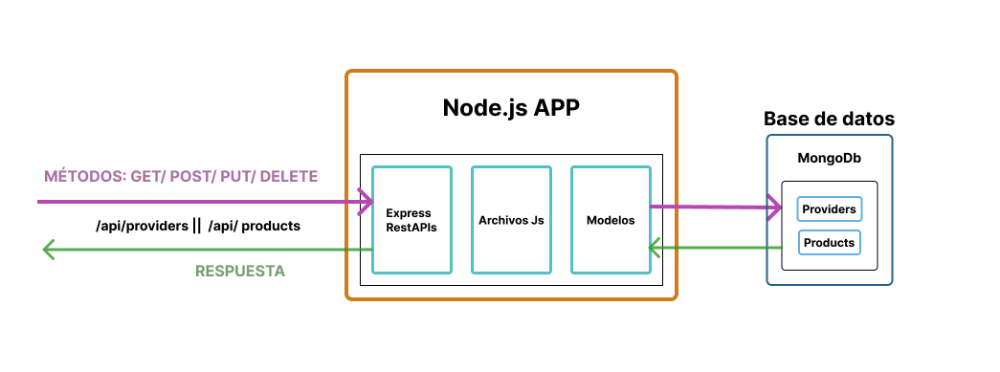

# Api_Mongoose
Api rest with MongoDb + Express
Welcome! This README file will provide you with an overview of the API, its features, how to use it, and other important information.
<br>
<br>

## API structure
This rest api is created on node.js with express (server), javascript files with business logic, models for data access control, databases with MongoDb (Non-relational database)
<br>

[](/README.md)
<br>
<br>

## API Base URL
The base URL's for accessing the API are: https://api-mongoose-alpha.vercel.app/api/providers and https://api-mongoose-alpha.vercel.app/api/products
<br>
<br>

### Introduction

The Api_Mongoose is an API for managing a collection of providers and it's products. It provides endpoints to retrieve, search, create, update, and delete them.
<br>
<br>

### Getting Started
Prerequisites
To use this API, you will need:

  1. Ensure that you have a local development environment set up with Node.js and npm installed.
  2. Make sure you have a data base conection. 
<br>
<br>

### Installation:

  1. Clone the Api_Mongoose repository to your local machine.
  2. Navigate to the project directory.
  3. Run the following command to install the dependencies:
<br>
<br>
```
  npm install
```
<br>

### Starting the API:

In the project directory, run the following command to start the API server:
<br>
<br>
```
  npm run dev
```
<br>
The API will be accessible at: 

  - https://api-mongoose-alpha.vercel.app/api/providers
  - https://api-mongoose-alpha.vercel.app/api/products
<br>
<br>

### Using the API:

  - You can send HTTP requests to the API using tools like cURL, Postman, or any programming language's HTTP library.
  - Refer to the provided endpoints in the API's README file for the available routes and their functionalities.
  - Use the appropriate HTTP methods (GET, POST, PUT, DELETE) and URLs to interact with the API.
  - Include your API key in the request URL for authentication when necessary.

### Examples routes:
<br>

#### To manage Providers:
<br>

1. To get information about one provider with the name , send a GET request to 
<br>

  ```
  EndPoint:

      https://api-mongoose-alpha.vercel.app/api/providers?company_name=Mama%20Conchi


  Response:

      [
        {
          "company_name": "Mama Conchi",
          "CIF": "A05000039",
          "address": "Av. de Rafael Alberti, 26, 28018 Madrid",
          "url_web": "https://www.instagram.com/comida_casera_mama_conchi/"
        }
      ]
  ```

<br>
<br>

2. To search for all providers, send a GET request to
  ```
  EndPoint:

      https://api-mongoose-alpha.vercel.app/api/providers


  Response:

      [
        {
          "company_name": "Roca Fría",
          "CIF": "B40579751",
          "address": "28033 Madrid",
          "url_web": "https://rocafria.com/"
        },
        {
          "company_name": "Mama Conchi",
          "CIF": "A05000039",
          "address": "Av. de Rafael Alberti, 26, 28018 Madrid",
          "url_web": "https://www.instagram.com/comida_casera_mama_conchi/"
        }
      ]
  ```
<br>
<br>

3. To create a new provider, send a POST request to 
```
EndPoint:

    https://api-mongoose-alpha.vercel.app/api/providers

request body:

    {
      "company_name": "Panda sushi",
      "CIF": "pand994",
      "address": "av.Pablo neruda 108, 28018 Madrid",
      "url_web": "www.pandasushi.eatbu.com"
    }

response: 

    {
      "message": "provider creado con éxito",
      "provider": {
        "company_name": "Panda sushi",
        "CIF": "pand994",
        "address": "av.Pablo neruda 108, 28018 Madrid",
        "url_web": "www.pandasushi.eatbu.com"
      }
    }
```
<br>

4. To update an existing provider, send a PUT request to 
```
EndPoint:

    https://api-mongoose-alpha.vercel.app/api/providers

request body:

    {
      "old_companyName": "Panda sushi",
      "new_companyData": {
        "CIF": "pand985"
      }
    }

response: 

    {
      "message": "provider Modificado con éxito",
      "newDataProvider": {
        "CIF": "pand985"
      }
    }
```
<br>

5. To delete an provider, send a DELETE request to 

```
EndPoint:

    https://api-mongoose-alpha.vercel.app/api/providers

request body:

    {
      "company_name": "Panda sushi 2"
    }

response: 

    {
      "message": "provider eliminado con éxito, company_name: Panda sushi 2"
    }
```
___
<br>
<br>

#### To manage Products:
<br>

1. To get one product with title , send a GET request to 

  ```
EndPoint:

    https://api-mongoose-alpha.vercel.app/api/products?title=Maki%20salmón


Response:

    {
      "message": "producto creado",
      "product": {
        "title": "Maki salmón",
        "price": 5,
        "description": "sushi",
        "image": "image",
        "provider": "648ca9e5380b8fefd581b750"
      }
    }
```

<br>
<br>

2. To get all products of a company with company name , send a GET request to 

  ```
EndPoint:

    https://api-mongoose-alpha.vercel.app/api/products?companyName=Panda%20sushi%202


Response:

    [
      {
        "title": "Maki salmón",
        "price": 5,
        "description": "sushi",
        "image": "image",
        "provider": {
          "company_name": "Panda sushi 2",
          "CIF": "pan8694",
          "address": "av.Pablo neruda 109, 28018 Madrid",
          "url_web": "www.pandasushi2.eatbu.com"
        }
      },
      {
        "title": "Sopa de pollo con champiñones",
        "price": 3.95,
        "description": "Sopa tradicional",
        "image": "https://encrypted-tbn0.gstatic.com/images?q=tbn:ANd9GcTf22KDdRrQ6U4tMniX3ZZ-0HLb3O2GrUWVHw&usqp=CAU",
        "provider": {
          "company_name": "Panda sushi 2",
          "CIF": "pan8694",
          "address": "av.Pablo neruda 109, 28018 Madrid",
          "url_web": "www.pandasushi2.eatbu.com"
        }
      },
      {...},
      {...}
    ]
  ```

<br>
<br>

3. To get all products , send a GET request to 

  ```
EndPoint:

    https://api-mongoose-alpha.vercel.app/api/products


Response:

    [
      {
        "title": "Maki salmón",
        "price": 5,
        "description": "sushi",
        "image": "image",
        "provider": {
          "company_name": "Panda sushi 2",
          "CIF": "pan8694",
          "address": "av.Pablo neruda 109, 28018 Madrid",
          "url_web": "www.pandasushi2.eatbu.com"
        }
      },
      {...},
      {...}
    ]
  ```

<br>
<br>

4. To create a new product, send a POST request to 
```
EndPoint:

    https://api-mongoose-alpha.vercel.app/api/products

request body:

    {
      "title": "Arróz frito con pollo",
      "price": 4.75,
      "description": "Arróz frito tradicional",
      "image": "https://pandarestaurant.es/wp-content/uploads/2021/11/Xian-soba-noodles.jpg",
      "provider_name": "Panda sushi"
    }

response: 

    {
      "message": "producto creado",
      "product": {
        "title": "Arróz frito con pollo",
        "price": 4.75,
        "description": "Arróz frito tradicional",
        "image": "https://pandarestaurant.es/wp-content/uploads/2021/11/Xian-soba-noodles.jpg",
        "provider": "648c9bce6329187183f210c7"
      }
    }
```

<br>
<br>

4. To update an existing entry, send a PUT request to 
```
    http://localhost:3000/api/entries?API_KEY=YOUR_API_KEY
```
<br>

5. To delete an entry, send a DELETE request to 

```
http://localhost:3000/api/entries?API_KEY=YOUR_API_KEY.
```
___
<br>
<br>

Remember to replace YOUR_API_KEY with your actual API key in the request URLs that require authentication.
<br>
That's it!, Happy Coding!!!.
<br>
<br>
___

<br>

[](https://www.gromarant.com/)
<br>

[&copy; Mariangelica Rodriguez](https://www.linkedin.com/in/mariangelica-rodr%C3%ADguez-p%C3%A9rez/)